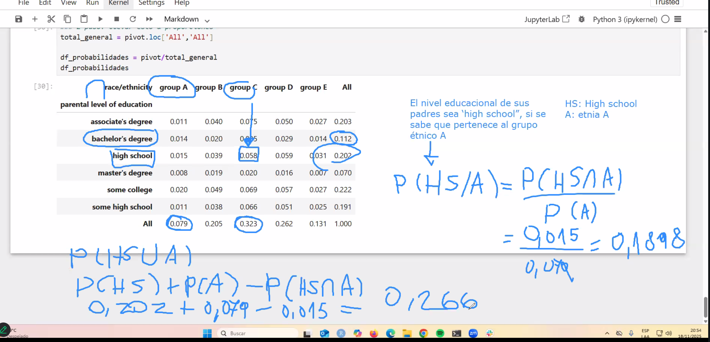

#1 calcular en tabla pivote las cantidades por nivel de educacion y etnia
pivot = pd.pivot_table (
    data = exams,
    index = 'parental level of education',
    columns = 'race/ethnicity',
    values = 'math score',
    margins = True,
    aggfunc = 'count'
)
pivot

### 2 paso: llevar esto a proporciones
total_general = pivot.loc['All','All']

df_probabilidades = pivot/total_general
df_probabilidades