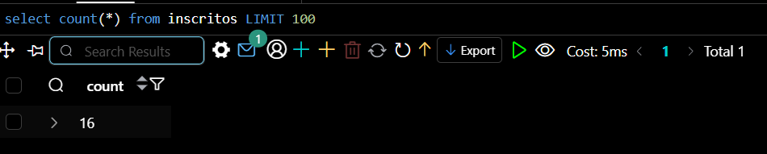
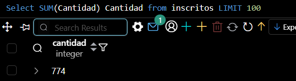
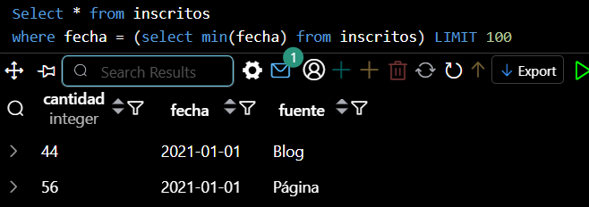
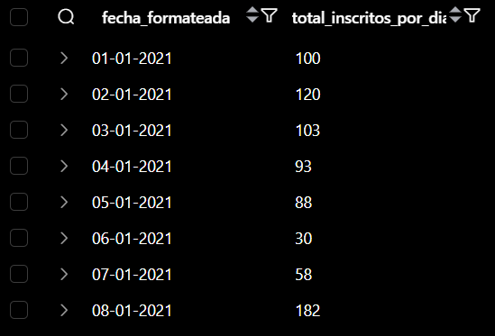
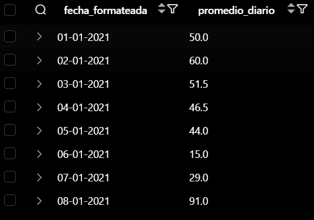
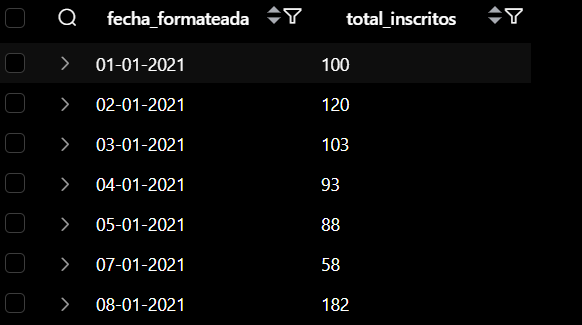
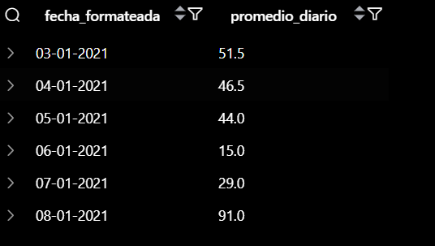

# DataScience

## Desafio Consultas Agrupadas
### Autor - Daniel Rojas Lopez


```sql
Select * from inscritos ;
```

1. ¿Cuántos registros hay?
```sql
select count(*) from inscritos;
```



2. ¿Cuántos inscritos hay en total?
```sql
Select SUM(Cantidad) Cantidad from inscritos;
```




3. ¿Cuál o cuáles son los registros de mayor antigüedad?  
```sql
Select * from inscritos
where fecha = (select min(fecha) from inscritos);
```



4. ¿Cuántos inscritos hay por día? (Indistintamente de la fuente de inscripción)

```sql
select TO_CHAR(fecha, 'DD-MM-YYYY') as fecha_formateada, sum(cantidad) as total_inscritos_por_dia
from inscritos
group by fecha
order by fecha;
```



5. ¿Cuántos inscritos hay por fuente?
```sql
select fuente, sum(cantidad) as total_inscritos_por_fuente
from inscritos
group by fuente;
```


6. ¿Qué día se inscribió la mayor cantidad de personas? Y ¿Cuántas personas se
inscribieron en ese día?
```sql
select TO_CHAR(fecha, 'DD-MM-YYYY') as fecha_formateada, sum(cantidad) as total_inscritos
from inscritos
group by fecha
order by total_inscritos desc
limit 1;
```


7.¿Qué día se inscribieron la mayor cantidad de personas utilizando el blog? ¿Cuántas
personas fueron? (si hay más de un registro con el máximo de personas, considera
solo el primero)

```sql
select TO_CHAR(fecha, 'DD-MM-YYYY') as fecha_formateada, sum(cantidad) as total_inscritos_blog
from inscritos
where fuente = 'Blog'
group by fecha
order by total_inscritos_blog desc
limit 1;
```


8. ¿Cuál es el promedio de personas inscritas por día? Toma en consideración que la
base de datos tiene un registro de 8 días, es decir, se obtendrán 8 promedios.
```sql
select TO_CHAR(fecha, 'DD-MM-YYYY') as fecha_formateada, ROUND(avg(cantidad), 1) as promedio_diario
from inscritos
group by fecha
order by fecha;
```


9. ¿Qué días se inscribieron más de 50 personas?
```sql
select TO_CHAR(fecha, 'DD-MM-YYYY') as fecha_formateada, sum(cantidad) as total_inscritos
from inscritos
group by fecha
having sum(cantidad) > 50
order by fecha;
```



10. ¿Cuál es el promedio por día de personas inscritas?
Considerando sólo calcular desde el tercer día.
```sql
select TO_CHAR(fecha, 'DD-MM-YYYY') as fecha_formateada, ROUND(avg(cantidad), 1) as promedio_diario
from inscritos
where fecha >= (select min(fecha) from inscritos) + interval '2 day'
group by fecha_formateada, fecha
order by fecha;
```



